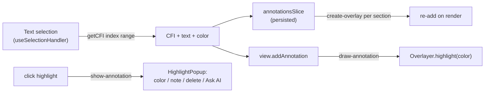

# Highlights & Notes + Book-Aware Ask

Two workstreams that mostly wire up capabilities the codebase already has (Foliate's annotation engine + already-generated chapter summaries).

## How highlights flow (already supported by Foliate)

## Workstream A - Highlights, Notes, and "Ask AI about this"

### A1. Data model + store
- `[src/types/index.ts]`: add `HighlightColor` and `Highlight` ( `id, bookId, cfi, sectionIndex, text, color, note?, chapterHref?, chapterLabel?, createdAt` ). Extend the `FoliateView` interface with `getCFI(index, range)`, `addAnnotation(annotation, remove?)`, `deleteAnnotation(annotation)`.
- New `[src/store/slices/annotationsSlice.ts]`: `highlights: Highlight[]` with `addHighlight`, `updateHighlight(id, {color?, note?})`, `removeHighlight(id)`, `getBookHighlights(bookId)` (mirrors `vocabularySlice`).
- `[src/store/useStore.ts]`: register slice, add `highlights` to `partialize` (this alone puts them in local + cloud backups), and extend the `removeBookFromLibrary` override to also drop highlights for the deleted book (same pattern used for `chapterPreviews`).
- `[src/constants/index.ts]`: add `HIGHLIGHT_COLORS` (id + hex, e.g. yellow/green/blue/pink) used both for the SVG fill and the picker UI.

### A2. Capture selection -> CFI
- `[src/hooks/useSelectionHandler.ts]`: keep the live `Range` and section `index` in a ref (index comes from the `load` event detail `{ doc, index }`, mapped per-doc). Expose `createHighlight(color)` that computes `viewRef.current.getCFI(index, range)`, writes to the store, and calls `viewRef.current.addAnnotation({ value: cfi, color })`. Expose current selection text for the Ask action.

### A3. Render + interact in the reader
- `[src/components/reader/Reader.tsx]`: in the view-creation effect (before `open()`), add listeners:
  - `draw-annotation` -> `draw(Overlayer.highlight, { color: hex })` (import `Overlayer` from `../../foliate-js/overlayer.js`).
  - `create-overlay` -> re-add this book's highlights whose `sectionIndex === index` (mirrors `reader.js` lines 172-176).
  - `show-annotation` -> open a new `HighlightPopup`.
- New `[src/components/selection-action-bar/HighlightPopup.tsx]`: positioned popup (reuse positioning logic from `SelectionActionBar`) with color swatches, a note textarea (save via `updateHighlight`), delete (`removeHighlight` + `view.deleteAnnotation`), and "Ask AI about this".
- `[src/components/selection-action-bar/SelectionActionBar.tsx]`: add a "Highlight" action (expands to color swatches) and an "Ask AI" action next to Copy/Translate/New Word. Wire `onHighlight`/`onAskAI` props passed down from `Reader`.

### A4. Notes list in the left sidebar
- `[src/components/reader/Sidebar.tsx]`: add a `Contents | Notes` segmented toggle. Notes view lists the current book's highlights (color dot, quoted text, note preview, chapter label), reusing the existing `onNavigate(href)` -> `view.goTo` which already accepts a CFI. Include per-item delete.

## Workstream B - Book-Aware Ask (reuse existing summaries)

Today `[src/hooks/useChapterChat.ts]` only injects the *current* chapter's `preview.fullSummary`, so "Connect to earlier" has no real prior context.

### B1. Build book memory
- `[src/utils/bookHelpers.ts]`: add `flattenTocHrefs(toc)` (depth-first ordered hrefs) and `buildBookMemory(book, chapterPreviews, bookId, currentTocHref)` that gathers `fullSummary` (fallback: themes/keyConcepts) from previews of chapters ordered *before* the current one - prior chapters only, to avoid spoilers.

### B2. Thread it through the prompt
- `[src/services/prompts.ts]`: add optional `bookContext` param to `createChatSystemPrompt`, injected as a `THE BOOK SO FAR (from earlier chapters you previewed)` section.
- `[src/services/llmService.ts]`: add optional `bookContext` arg to `streamChapterChat`.
- `[src/hooks/useChapterChat.ts]`: compute `buildBookMemory(...)` and pass it in.

### B3. "Ask AI about this" plumbing
- `[src/store/slices/aiSidebarSlice.ts]`: add `pendingQuote: string | null` + `setPendingQuote`.
- `[src/components/chat/AskTab.tsx]`: on `pendingQuote`, prefill the input with the quoted passage, focus, then clear it.
- The selection/highlight "Ask AI" handlers call `toggleAiSidebar(true)` + `setActiveAiTab("ask")` + `setPendingQuote(text)`.

## Verification
- `npm run lint` and `npm run build` (tsc) clean.
- Manual: select -> highlight (color persists after reload and section re-render), click highlight -> edit note / change color / delete / Ask AI; Notes list navigates via CFI; generate previews for ch.1-2, then ask a ch.3 question that references earlier chapters and confirm the model has that context; verify highlights survive an export/import backup.

## Out of scope (deferred)
Vocabulary SRS, in-book search, "recap so far", TTS. No new dependencies required.