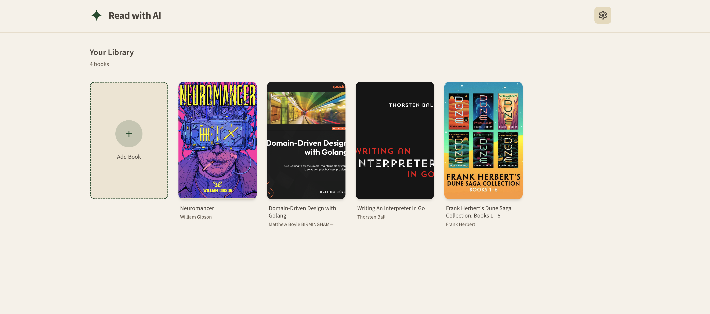
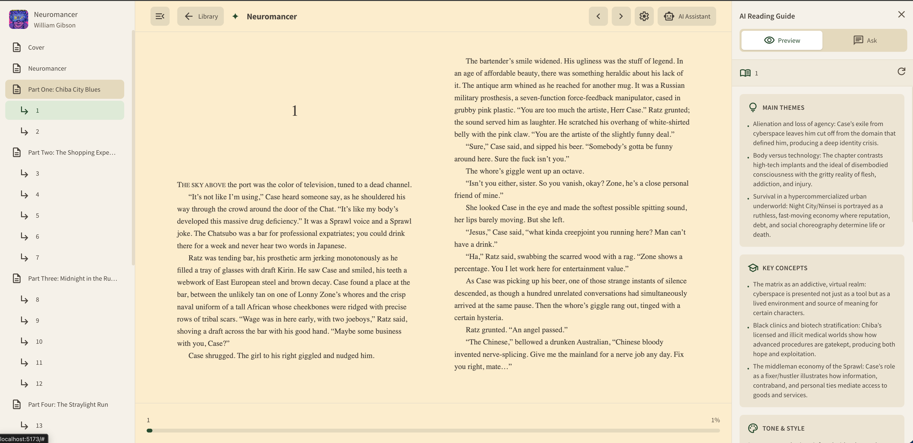
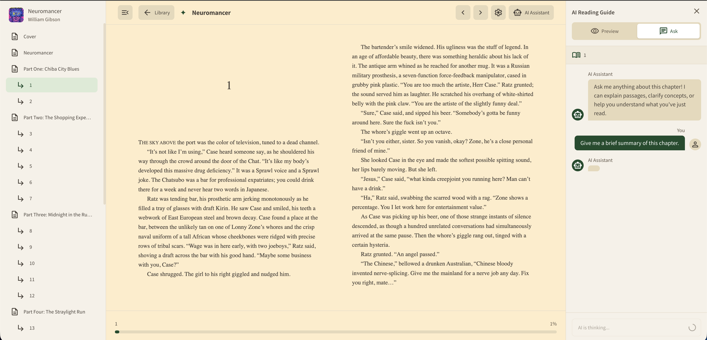

# Read with AI

An EPUB reader with AI assistance for deeper reading comprehension.



## The Problem

Reading complex books—whether dense non-fiction or layered fiction—often requires active engagement: orienting yourself before diving in, pausing to clarify confusing passages, and connecting ideas across chapters. This app brings AI into that process.

## How It Works

### Preview Before Reading

Before starting a chapter, generate a brief orientation:



- Main themes to watch for
- Key concepts or vocabulary
- Guiding questions to keep in mind

This primes your attention without spoiling the content.

### Ask While Reading

Got stuck on a passage? Wondering how something connects to earlier chapters? Ask.



The AI has context about the book and your current chapter, so you can have a focused conversation about what you're reading.

### Instant Word Lookup

Select any text while reading to:

- **Translate/Define** — Get instant definitions powered by AI
- **Save to Vocabulary** — Add words to your personal vocabulary list with auto-generated definitions
- **Copy** — Quick copy to clipboard

### Build Your Vocabulary

All saved words go to a dedicated Vocabulary page where you can:

- Review words with their AI-generated definitions
- See which book each word came from
- Track when words were added
- Remove words you've mastered

### Customize Your Reading

Adjust typography settings to match your preferences:

- Font family (Literata, Georgia, Merriweather)
- Font size (12-24px)
- Line height (1.2-2.0)

### Backup & Sync

Export your entire library to transfer between devices. Backups include:

- All your books 
- Reading progress and positions
- Saved vocabulary words
- App settings (typography, LLM configuration)

## Setup

```bash
npm install
npm run dev
```

Configure your LLM provider in Settings → LLM tab. Works with OpenAI API or any compatible endpoint (OpenRouter, local models, etc.).

## Privacy

Books and settings stay in your browser. Your API key only goes to whatever LLM endpoint you configure.

## Stack

React, TypeScript, Zustand, Tailwind, Vite, Foliate.js for EPUB rendering.
