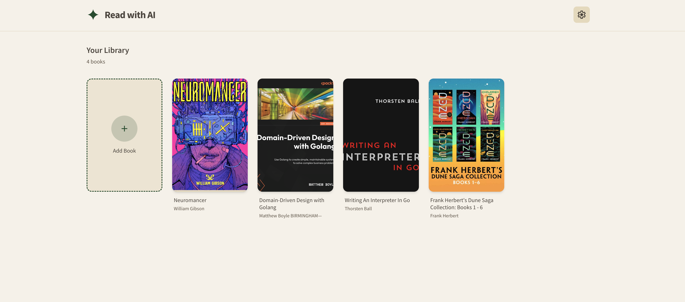
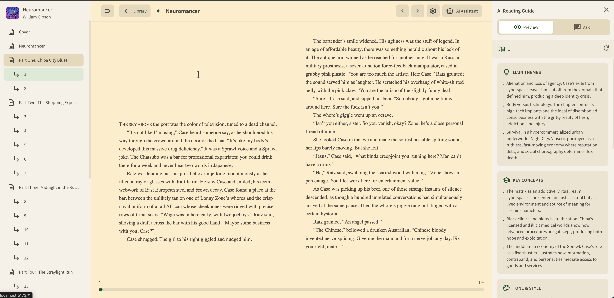
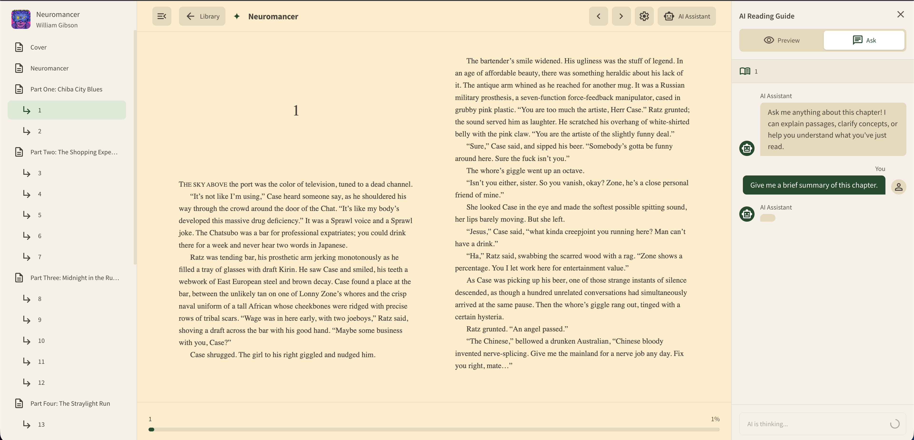

# Book Tutor

An AI-powered EPUB reader that helps you understand what you're reading. Everything runs in the browser — your books, progress, and settings stay on your device. The only external call is to the LLM API you configure in Settings.

- Read EPUBs with a table of contents, progress tracking, and resumable reading position
- Generate spoiler-free chapter previews before you start reading
- Ask the AI about the current chapter while you read
- Select text to translate, highlight, copy, save to vocabulary, or ask AI about a passage
- Review saved words on a personal vocabulary page with AI-generated definitions
- Highlights and notes in the reader sidebar
- Customizable typography and color themes
- Export/import backups (books, progress, vocabulary, settings)
- Optional cloud sync for your library backup







```bash
npm install
npm run dev
```

Configure your LLM provider in Settings. Works with OpenAI or any compatible API (OpenRouter, local models, etc.).